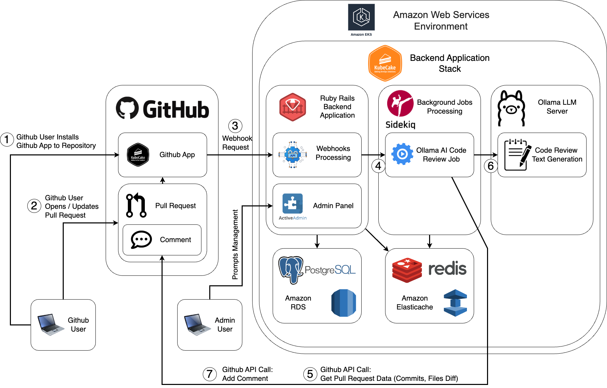

# High-Level Solution Design

Main app installation and code review flows are shown here at diagram.

There are many webhooks at Github Apps, currently supported are:

- Github App Installation
- Github App Deletion
- Pull Request Opened
- Pull Request Reopened
- Pull Request Edited