# KubeCake

<p align="center">
  
</p>

## Intro

KubeCake is a DevOps GitOps, Infrastucture code reveiw app made as a task at the DevOps Course Hackathon.

Link to Github App Installation [KubeCake Glaze](https://github.com/apps/kubecake-glaze) 

#### NOTE:
*If you want to try it then do it in yours own Github App (See instructions below) or infrastructure. As this demo Github App's Backend might not be running at the moment.*

## Video demonstration

[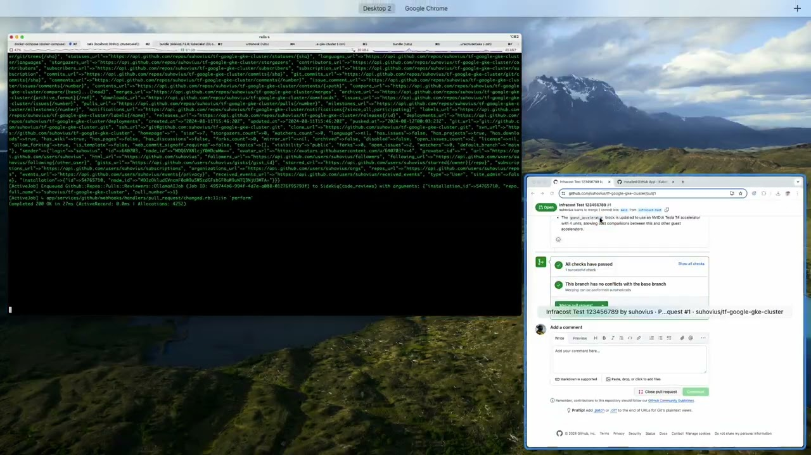](http://www.youtube.com/watch?v=vk1Nq5niAsM "Click to watch")

## Architectural Decision Records (ADR)

App Tech stack: Ruby on Rails, Active Admin, Sidekiq, Postgres, Redis, Ollama.

Proposed Infrastructure stack: Kubernetes, Docker, Helm, Flux, Terraform, AWS.

Read more at [ADR File](.data/ADR.md)

## High-Level Solution Design (HLD)

See solution diagram here [HLD File](.data/HLD.md)

## Main Feature

Integration with Github and reviewing pull requests with the help of configurable Ollama prompts

## Features + Techincal Details

Also app provides example of admin panel access permissions by presenting the notion of the `organization_admin` (out of scope as for now) role along with `super_admin` role. `AdminUser` entities can be managed by admins with super admin role.
Super admin also can see and manage all the organizations and their related entites data.
While organization admins can only manage organsations data to which they are granted access to.

Also admin panel allows `super_admin` users to see the rSwag API documentation (INFO: currenlty empty) and to monitor the state of the sidekiq bacground jobs and scheduled jobs at the 'Settings' menu section. Super admin users also can be managed there.

Observed github repository pull requests must trigger the webhooks, which schedule background job that performs pull request code review with Ollama prompts and adds comments to the pull request.

Prompt templates should be able to be configured/assigned per each prevously synched repo by Super Admin. Also multipe prompts and their execution order should be able to managed. So there must be manageable collection of diffrent prompts and ability to assign and arrange their order per each project.

Also Admin Panel should show all the synched Github Repositories and Accounts data.

#### *NOTE: Currently Admin Panel is just a template. View synched Accounts, Repositories and Prompts per Repo editing feature will be available before Hackathon project demonstration. Currently it uses hardcoded prompt template.*

`Organization` (*INFO: Organizations and organization admins are currently out of scope*) presents business concept of some kind of corporate client of this admin panel.
Organization has such related entites like: Github App configs, and authorized attached github repositories.

## Purpose

Make MVP app for the DevOps Course hackathon, a configurable plantform to perform AI code reviews at Github with future expansion to different SCM platforms like Gitlab, Bitbucket, etc. It provides extendable architecture to support multiple AI sources in future.
Main purpose for MVP is to test the general implementation and basic functionality of the app.

## Deployment Settings (TODO: TBD Add description with DevOps!)

*Repo has such DevOps area features as:*

| Directory         | Description                                  |
| ----------------- | -------------------------------------------- |
| .github/workflows | Github Actions Workflows                     |
| helm              | Helm Charts                                  |
| k8s               | Kubernetes Deployment manifests              |
| terraform         | Terraform infrastructure configuration files |

## Dependencies

### Ruby version

`ruby 3.3.1`

## Ruby Version manager

[rbenv](https://github.com/rbenv/rbenv) is recommended to be used as ruby version manager for local development. It automatically accepts the ruby version settings from the `.ruby-version` file.

### System dependencies to start at local machine

`Docker (Docker Desktop)`, `ruby 3.3.1`

### Configuration at local machine with docker

- Run this command in the terminal `cp docker-compose.yml.example docker-compose.yml` to create docker compose file form the provided example

- Generate random key set with this `DATABASE_URL=dummy DATABASE_PORT=123 DATABASE_USER=dummy bin/rails db:encryption:init` in your termial. Pan no mind onto these weir dummy values they are just needed to load the enviromnent for this command, these values are not involved in the key set generation.
Command output will contain something like this:

```yaml
active_record_encryption:
  primary_key: <your generated primary_key value>
  deterministic_key: <your generated deterministic_key value>
  key_derivation_salt: <your generated key_derivation_salt value>
```

- Inside your local `docker-compose.yml` file at `rails` and `sidekiq` environment sections assign previously generated values at respective variables

```yaml
services:
  rails:
    # ...
    environment:
      # ...
      ACTIVE_RECORD_ENCRYPTION_PRIMARY_KEY: <your generated primary_key value>
      ACTIVE_RECORD_ENCRYPTION_DETERMINISTIC_KEY: <your generated deterministic_key value>
      ACTIVE_RECORD_ENCRYPTION_KEY_DERIVATION_SALT: <your generated key_derivation_salt value>
      # ...
  sidekiq:
    # ...
    environment:
      # ...
      ACTIVE_RECORD_ENCRYPTION_PRIMARY_KEY: <your generated primary_key value>
      ACTIVE_RECORD_ENCRYPTION_DETERMINISTIC_KEY: <your generated deterministic_key value>
      ACTIVE_RECORD_ENCRYPTION_KEY_DERIVATION_SALT: <your generated key_derivation_salt value>
      # ...
```

- Start project with `SUPER_ADMIN_PASSWORD=your_super_password docker-compose up` (Don't forget to provide your own secure password here instead of `your_super_password`. As it will be the password of the admin user with highest level of access permissions). By default super admin login email is `super.admin@kubecake.com`

- Environment variables `GITHUB_APP_CLIENT_ID` and `GITHUB_APP_PRIVATE_PEM` (pem file contents as one line if `.env` file is used `File.read("<path to app private pem file>").dump` if rails app runs without via `rails s -p 3000`) must be obtained from the Github App setup.

- `OLLAMA_SERVER_ADDRESS` locally installed `Ollama` address `http://localhost:11434` with downloaded `llama3.1` model via terminal command `ollama run`. In production environment this varibale must contain Ollama server address within the deployment enviroment.

- During starting process database also will be prepopulated with some dummy demo entities like Organization and some dummy data

- After docker compose has finished starting up the application, open application domain `http://0.0.0.0:3000/` and enter the created above super admin credentials. It should log in you into the admin panel of the appication.

### Normal rails development docker-copmose.yml usage with normal code reload

`docker-compose up` is used for `postgres` and `redis` services only while all the rest rails/ruby services are used manually as it is better for local development.

Comment `rails` and `sidekiq` services as they will be started manually when needed via terminal `rails s -p 3000` and `bundle exec sidekiq -C config/sidekiq.yml`. Configure needed ENV variables at `.env` file (see `.env.example` file)

### How to run tests

- Run specs with `bundle exec rspec` command

*Currently this projects does not have any tests as for now*

### Local development setup

For local develpment purposes, in order to work with callbacks and redirects from Github, tunnel to local machine will be required [cloudflared](https://developers.cloudflare.com/cloudflare-one/connections/connect-networks/do-more-with-tunnels/trycloudflare/) service is suggested to be used for that purpose.

Use this command to run tunner for local app, ajust port if your local rails app runs not on default rails port `3000`.

`cloudflared tunnel --url http://localhost:3000`

WARNING! `cloudflared` will generate new domain per each run, so you will need to update Github App settings `each time`.

So, thus there is another good tool `ultrahook` for local hooks tunnes (but it supports POST requests only)

[https://www.ultrahook.com/](https://www.ultrahook.com/)

```
$ gem install ultrahook
$ ultrahook kubecake 3000
Authenticated as suhovius
Forwarding activated...
https://suhovius-kubecake.ultrahook.com -> http://localhost:3000
```

Also at `config/environments/development.rb` hosts must be configured if different service/domain is used

```
config.hosts = [
  /.*\.trycloudflare\.com/, # Allow requests from subdomains like `indexed-chart-oriented-italiano.trycloudflare.com`
  /.*\.ultrahook\.com/, # Allow requests from subdomains like `https://suhovius-kubecake.ultrahook.com`
  'localhost'
]
```

# Github App configuration

If you plan to setup yours own Github App look [here](https://docs.github.com/en/apps/creating-github-apps/registering-a-github-app/registering-a-github-app)

## Basic Configuration

##### *Saved App IDs that later will be needed for server setup*

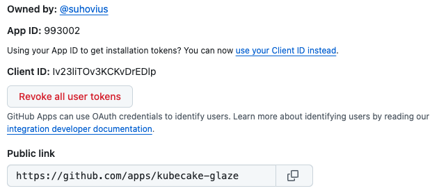

##### *Fill basic information, app name must be unique amoung github accounts*

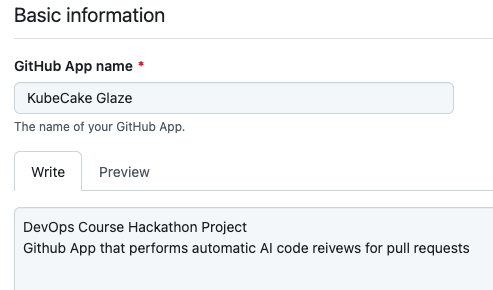

In `Homepage URL` field put `https://github.com/apps/kubecake-glaze` or use your Github Application name instead of `kubecake-glaze`

Current version does not have any public website, but rather super admin panel thus this domain does not need to be shown here.

Leave `Identifying and authorizing users` section as empty as we do not have any Github User authorization as for now.

`GITHUB_WEBHOOK_SECRET_TOKEN` must contain the same webhook secret as configured at app webhooks page

Leave post installation `Setup URL` empty

## Webhooks

##### *Webhooks URL Setup*

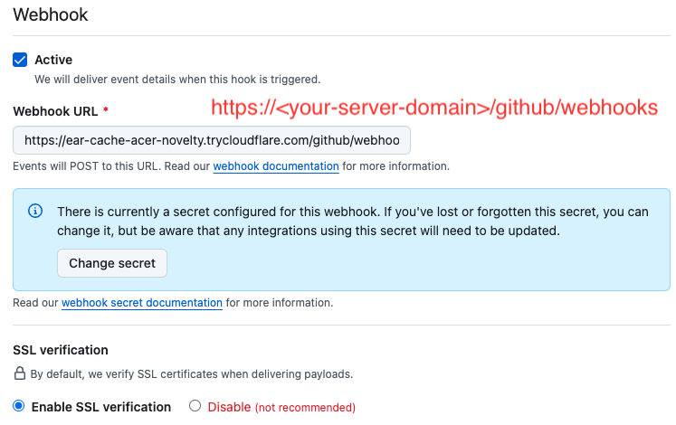

Check `Active` and enter `Webhook URL`: your domain with path `/github/webhooks`

For examle this temporary development tunnel domain and path like this (our use your real app domain at production)

`https://ear-cache-acer-novelty.trycloudflare.com/github/webhooks`

## Display Information, App Icon/Logo

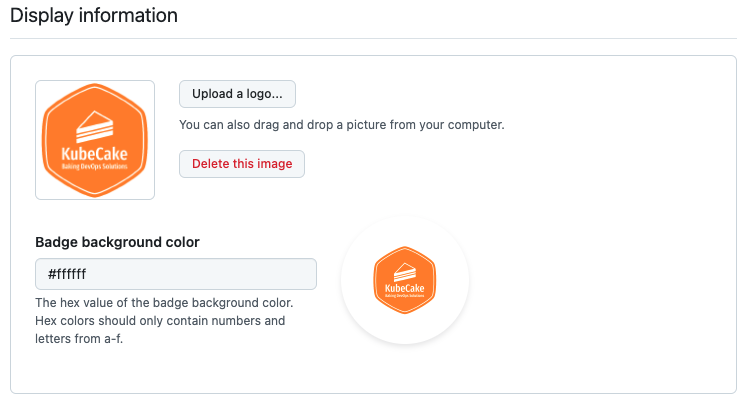

## Github App Permissions

In `Repository permissions` select:
* `Contents` as `Read only`
* `Metadata` as `Read only`
* `Pull requests` as `Read and write`

At `Where can this GitHub App be installed?` select `Any account`

*Repository permissions setup*

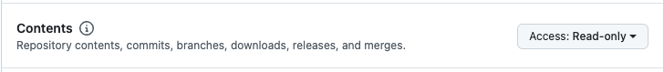

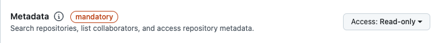

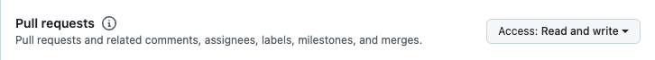

## Subscribe to events

In `Subscribe to events` select checkboxes for:
* `Installation target`
* `Meta`
* `Pull request` (Will be processed only at this MVP Application version as for now)

*Events setup*

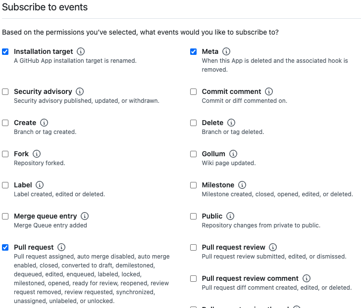

## Private Key

Generate Private Key and save pem file it later will be used for app tokens generation.

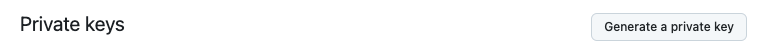

`Client ID`, `Private Key`, and `Installation ID`s will be used for Github API calls

## Advanced Github App Setup

`Advanced` tab can be seen after app is already created.

There is nice feature to `redeliver` failed webhooks that is good for development and testing.
Status, Headers, Payload and other information can be seen there.

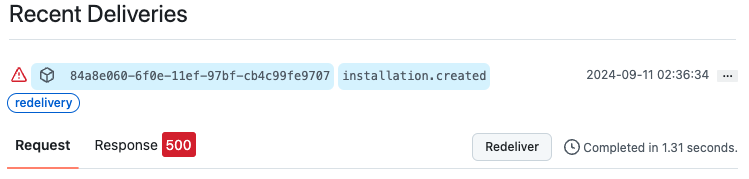
